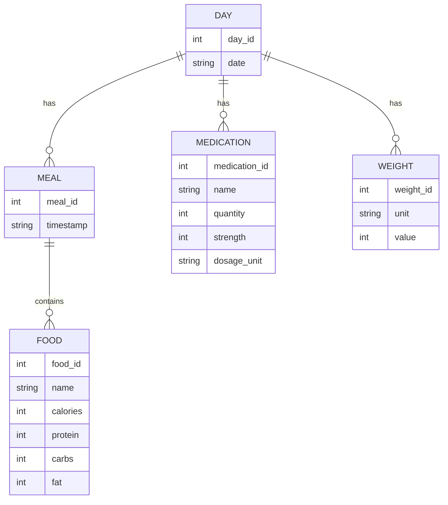

```mermaid
erDiagram
    DAY {
        int day_id
        string date
    }
    MEAL {
        int meal_id
        string timestamp
    }
    FOOD {
        int food_id
        string name
        int calories
        int protein
        int carbs
        int fat
    }
    MEDICATION {
        int medication_id
        string name
        int quantity
        int strength
        string dosage_unit
    }
    WEIGHT {
        int weight_id
        string unit
        int value
    }
    DAY ||--o{ MEAL : has
    DAY ||--o{ MEDICATION : has
    DAY ||--o{ WEIGHT : has
    MEAL ||--o{ FOOD : contains
```
